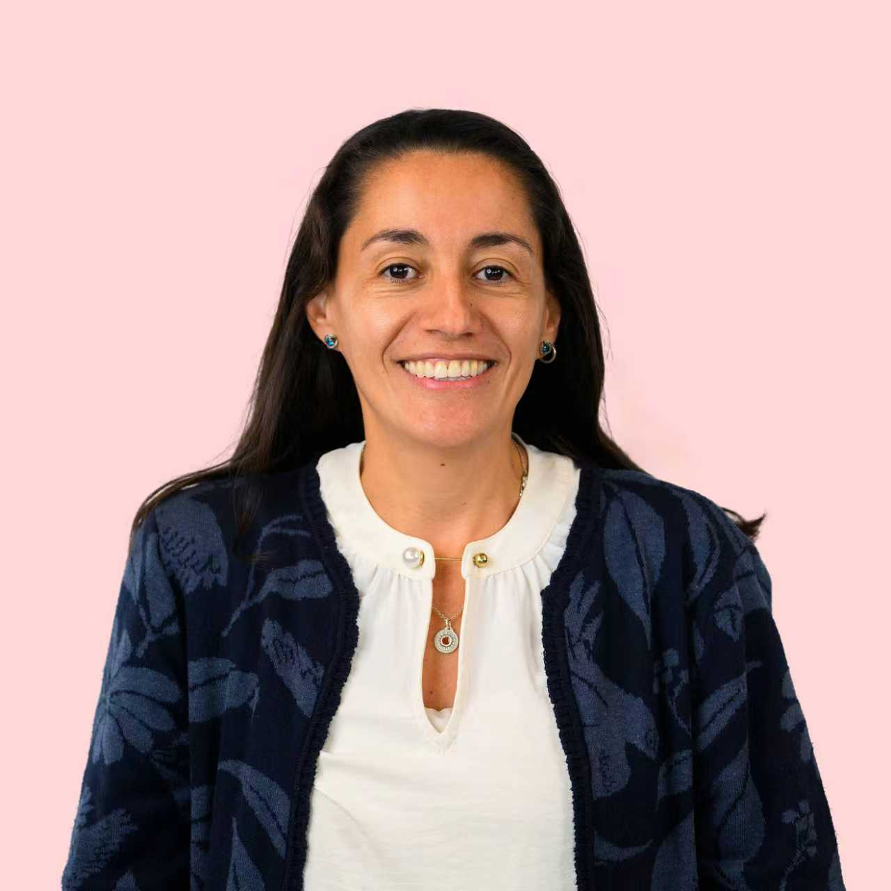
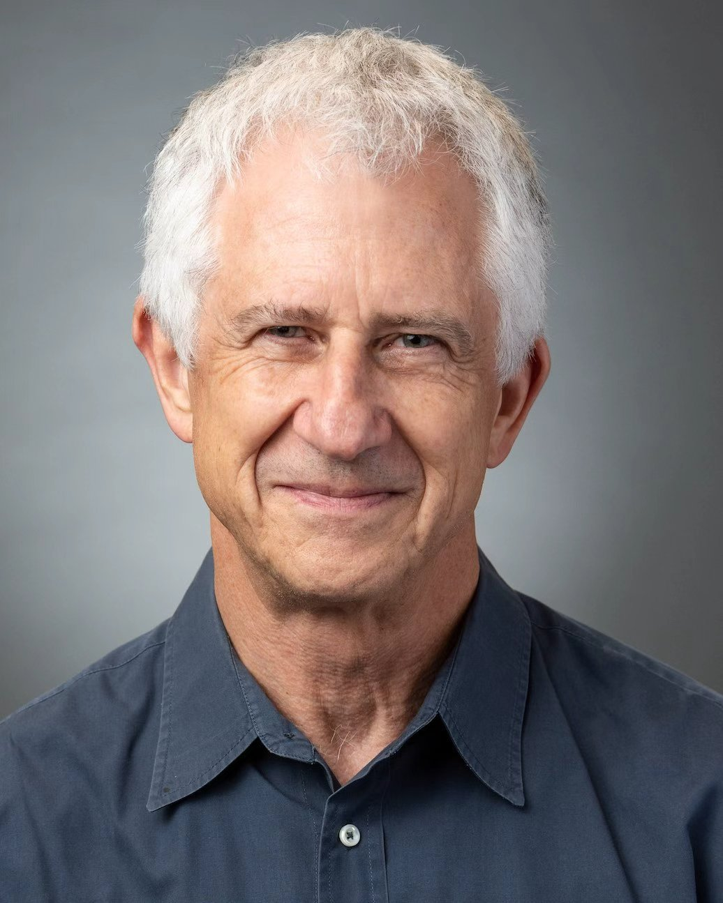

<h2 align="center">Coordinators</h2>

<section class="member-section">
  

    

      

        
      

      

        <h2 class="member-name">Zlatko Bodrožić</h2>
        

          
University of Liverpool, UK (Lead Coordinator)

          <a href="mailto:Z.Bodrozic@liverpool.ac.uk">Z.Bodrozic@liverpool.ac.uk</a>
        

      

    

    

      
Zlatko Bodrožić is Professor in Digital Enterprise at the University of Liverpool. He received his PhD from the University of Helsinki, was previously Associate Professor in Technology, Organisation and Sustainability at the University of Leeds, and has also taught at the Universities of Belgrade, Bonn, Hamburg, and Hanover. His research examines the interaction of technologies, management models, organizational paradigms, and public policy regimes. His work has been published in leading journals including Administrative Science Quarterly, Organization Science, Academy of Management Perspectives, and Journal of Management Studies. His current research focuses on the evolution of societal governance systems in relation to digital transformation, climate change, and healthcare. At EGOS, he previously served as co-coordinator of the Standing Working Group “Organization Studies in the Anthropocene: System Change, Not Climate Change” (2021–2026).

    

  

  

    

      

        
      

      

        <h2 class="member-name">Pilar Acosta</h2>
        

          
Toulouse Business School, France

          <a href="mailto:p.acosta@tbs-education.fr">p.acosta@tbs-education.fr</a>
        

      

    

    

      
Pilar Acosta is Associate Professor at Toulouse Business School in France. She studies how individuals and businesses navigate and negotiate changes in environmental and social responsibilities, particularly in the Global South. She has examined interactions between private and public actors in contexts of limited statehood, suppliers’ responses to sustainability demands, and the tensions managers face when balancing growth with environmental protection. She currently serves as section co-editor for the Corporate Sustainability and Ethics section of the Journal of Business Ethics.

    

  

  

    

      

        
      

      

        <h2 class="member-name">Paul S. Adler</h2>
        

          
University of Southern California, USA

          <a href="mailto:padler@marshall.usc.edu">padler@marshall.usc.edu</a>
        

      

    

    

      
Paul Adler is currently the Harold Quinton Chair Emeritus in Business Policy and Professor Emeritus of Management and Organization at the Marshall School of Business, University of Southern California. His research and teaching focus on organization theory and comparative political economy. He has published widely in academic journals, and has edited or co-edited several volumes, the more recent being <strong>The Firm as a Collaborative Community: Reconstructing Trust in the Knowledge Economy</strong> (2006), <strong>The Oxford Handbook of Sociology and Organization Studies: Classical Foundations</strong> (2009), and <strong>The Oxford Handbook of Sociology, Social Theory and Organization Studies: Contemporary Currents</strong> (2015). He co-authored <strong>Healing Together: The Labor-Management Partnership at Kaiser Permanente</strong> (2009), and most recently published <strong>The 99% Economy: How Democratic Socialism can overcome the Crises of Capitalism</strong> (2019).

    

  

  

    

      

        
      

      

        <h2 class="member-name">Gerald F. Davis</h2>
        

          
University of Michigan, USA

          <a href="mailto:gfdavis@umich.edu">gfdavis@umich.edu</a>
        

      

    

    

      
Jerry Davis received his PhD from Stanford and taught at Northwestern and Columbia before moving to the University of Michigan, where he is Gilbert and Ruth Whitaker Professor of Business Administration and Professor of Sociology. He has published widely in management, sociology, and finance. His books include Social Movements and Organization Theory (2005); Organizations and Organizing (2007); Managed by the Markets: How Finance Reshaped America (2009); Changing your Company from the Inside Out: A Guide for Social Intrapreneurs (2015); The Vanishing American Corporation (2016); and Taming Corporate Power in the 21st Century (2022).

      
Davis’s research is broadly concerned with the effects of finance on society, changes in the corporate economy, and new forms of organization. Recent writings examine how ideas about corporate social responsibility have evolved to meet changes in the structures and geographic footprint of multinational corporations; whether "shareholder capitalism" is still a viable model for economic development; how income inequality in an economy is related to corporate size and structure; why theories about organizations do (or do not) progress; how architecture shapes social networks and innovation in organizations; why stock markets spread to some countries and not others; and whether there exist viable organizational alternatives to shareholder-owned corporations in the United States.

      
You can find out more at <a href="https://sites.google.com/a/umich.edu/jerrydavis/home" target="_blank" rel="noopener noreferrer">Jerry Davis Homepage
  </a>

  

    

      

        
      

      

        <h2 class="member-name">Alfred Tat-Kei Ho</h2>
        

          
City University of Hong Kong, Institute of Global Governance and Innovation for a Shared Future, Hong Kong

          <a href="mailto:ho.tkalfred@cityu.edu.hk">ho.tkalfred@cityu.edu.hk</a>
        

      

    

    

      
Professor Alfred Tat-Kei HO is the Chair Professor of Public Policy and Governance of the Department of Public and International Affairs, the Dean of the College of Liberal Arts and Social Sciences, and the Director of the Institute of Global Governance and Innovation for a Shared Future, all at City University of Hong Kong. He is also an elected fellow (overseas) of the National Academy of Public Administration in the U.S., the Vice President (Asia) of the International Research Society for Public Management (IRSPM), an advisory group member of the Chief Executive’s Policy Unit of the Hong Kong Special Administrative Region, and an advisor to the Hong Kong International Academy Against Corruption.  Professor Ho’s research focuses on government performance management, e-government, citizen engagement, and recently, on cross-sectoral collaboration in industrial development.  He has collaborated with many local governments in the U.S. and China, as well as with think tanks, national and international organizations, and professional associations, including the United Nations Trade and Development (UNCTAD), the China Development Research Foundation, the Asian Development Bank, the IBM Center for the Business of Government, the Alfred P. Sloan Foundation, and the Federation of Hong Kong Industries. Professor Ho received his bachelor’s degree in Social Sciences from the Chinese University of Hong Kong and his Master of Public Administration and Ph.D. from Indiana University, Bloomington, USA.  He taught in three different universities in the U.S. for more than 20 years before returning to Hong Kong in December, 2020.

    

  

  

    

      

        
      

      

        <h2 class="member-name">Nicole Ning Liu</h2>
        

          
City University of Hong Kong, Department of Public and International Affairs, Hong Kong

          <a href="mailto:ning.liu@cityu.edu.hk">ning.liu@cityu.edu.hk</a>
        

      

    

    

      
Ning Liu is Associate Professor in the Department of Public and International Affairs and Deputy Director of the Centre for Public Affairs and Law at City University of Hong Kong. Her research focuses on government-business relations, regulation and compliance, and AI governance. She has led multiple projects funded by the National Natural Science Foundation, the Hong Kong Research Grants Council, and the Innovation and Technology Commission. Her research has been published in top academic journals in Management, Public Administration and Policy. She currently serves as co-editor of Regulation & Governance.

    

  

</section>

***

<h2 align="center">Contact Us</h2>

For inquiries about the seminar series or the SWG, please feel free to contact any of the coordinators listed above. In line with our goal of fostering a genuinely international and comparative dialogue across continents, we welcome you to reach out to whichever coordinator you prefer.

